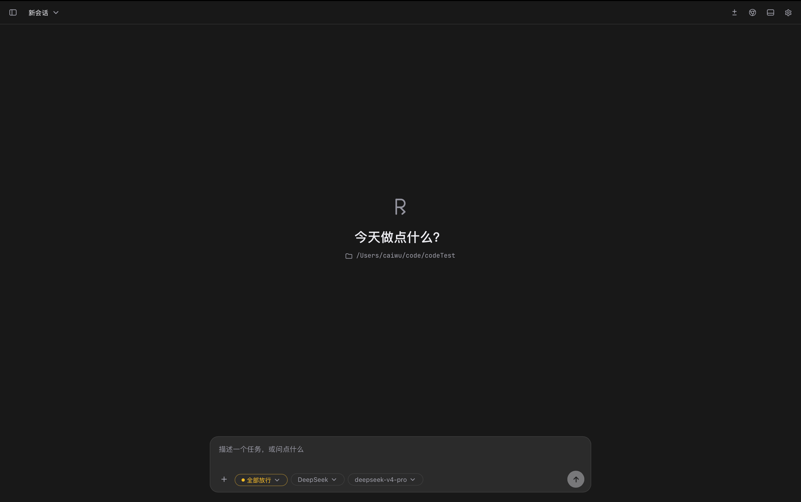
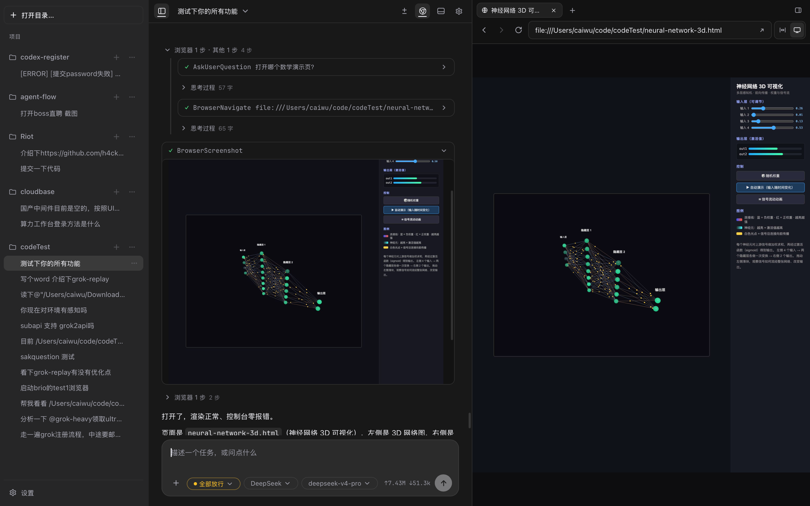
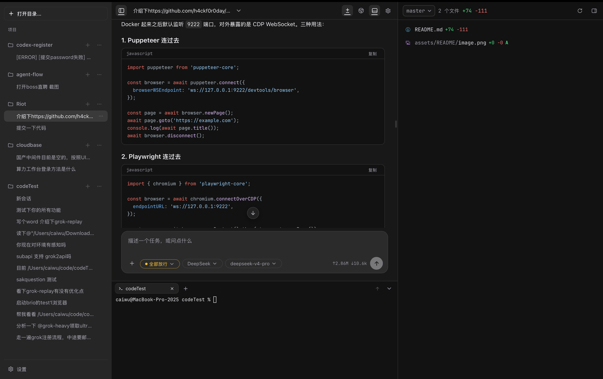

<div align="center">
  

# Riot

**Codex 的开源替代。** Cursor 的工作台，Claude Code 的权限与扩展。

[Release](https://github.com/caiwuu/Riot/releases/latest) ·
[能力](#能力) ·
[开始使用](#开始使用) ·
[开发](#开发) ·
[架构](#架构) ·
[许可](#许可)

[](https://github.com/caiwuu/Riot/releases/latest)
[](LICENSE)
[](#开始使用)
[](https://v2.tauri.app)
</div>

---

Riot 是独立的桌面 Agent：宿主和内核分进程，模型走你自己的 API。读仓库、改代码、写文档、跑命令，全部发生在你的机器上，不把项目交到别人的云端执行环境。

它不是 IDE。对话、终端、浏览器、Git 改动和文档预览在同一扇窗口里；写文件和跑命令默认先问再做。





## 能力

### Agent 与对话

- 流式对话：思考、工具调用、回答分块展示
- 规划模式：计划写成项目里的 `.riot/plans/*.plan.md`，点「构建」再动手
- 多任务：主 agent 协调，检索和实现交给后台子 agent
- `@` 引用文件；拖放或粘贴附件（图片进附件条，其它收成 `@`）
- 编辑历史、回滚整轮、重新生成；可按会话设系统提示词
- 自带模型：OpenAI 兼容或 Anthropic Messages。DeepSeek、Kimi、Qwen、OpenRouter、vLLM、Ollama 都走前者

### 工作台

- 侧栏按项目分组的会话，流式对话不打断旁边的终端和预览
- 内嵌终端（xterm.js + PTY），可共享给 agent
- 内置 Chromium：导航、点击、填表、截图、DOM 拾取，你和模型看见同一页
- 右侧 Git 改动面板；会话改动条随时可回看
- 代码、Markdown、Word / Excel / PPT / PDF 预览

### 权限与扩展

- 六档权限：每次询问 / 编辑放行 / 规划 / 自动判危 / 全部放行 / 无人值守
- 危险目标（SSH 密钥、启动脚本、hooks）即使「全部放行」也先问
- macOS 沙箱开箱即开；Windows 沙箱需另装，默认不开
- Skills、斜杠命令、Hooks、MCP、项目记忆（`AGENTS.md`，没有则读 `CLAUDE.md`）
- 改完下一轮生效，不用重启

### 文档与浏览器

- 创建和编辑 Word、Excel、PPT、PDF；表格走真实公式求值
- Word / PPT / PDF 渲成页面图，模型逐页看过再交付
- 文档运行时按需安装（设置 → 能力包），不必预装 Python、Node 或 LibreOffice
- 抓包、HAR 导出、请求重放、拦截修改

### 远程与定时

- 手机或另一台电脑的浏览器里接上正在跑的桌面 Riot，任务仍在原机器执行
- 按每日、工作日、每周或指定时间编排任务，支持延时与漏跑补偿

## 开始使用

### 环境

| 要求 | 版本 |
| --- | --- |
| Rust | 1.88+ |
| Node.js | 22 |
| pnpm | 10 |
| 模型 API key | OpenAI 兼容或 Anthropic；从源码跑时必填 |

预编译安装包见 [GitHub Releases](https://github.com/caiwuu/Riot/releases/latest)。macOS 首发，Windows 同步支持。

### 安装 macOS

下载最新 `Riot_*_aarch64.dmg`（仅 Apple Silicon），拖进「应用程序」。

未签名的包会被 Gatekeeper 拦住。不要关系统防护，用访达右键 → 打开，或：

```bash
xattr -dr com.apple.quarantine /Applications/Riot.app
open /Applications/Riot.app
```

### 安装 Windows

下载最新 `Riot_*_x64-setup.exe`（Windows 10 / 11 · x64），按向导安装。

### 从源码跑

```bash
git clone https://github.com/caiwuu/Riot.git
cd Riot
pnpm install
pnpm tauri dev
```

第一次启动会选择项目目录。在设置里添加服务方、粘贴 API key、选中模型即可对话。

内置浏览器是可选能力：没打过 CEF 包也能起主应用，只是 Browser 工具和面板不可用。打包步骤见 [docs/DEVELOPMENT.md](docs/DEVELOPMENT.md)。

### 扩展点

配置目录在设置 → 关于里可以看到。macOS 默认是 `~/Library/Application Support/riot`，Windows 是 `%APPDATA%\riot`。

| 能力 | 全局 | 项目级 |
| --- | --- | --- |
| 记忆 | `<配置目录>/AGENTS.md` | `<项目>/AGENTS.md`（没有则读 `CLAUDE.md`） |
| Skills | `<配置目录>/skills/<名>/SKILL.md` | `<项目>/.riot/skills/` |
| 斜杠命令 | `<配置目录>/commands/*.md` | `<项目>/.riot/commands/` |
| Hooks | `<配置目录>/hooks.json` | `<项目>/.riot/hooks.json`（两层都跑） |
| MCP | 设置 → MCP | — |
| 能力包 | 设置 → 能力包（文档运行时等） | — |

- 输入框敲 `/` 调斜杠命令。`$ARGUMENTS` 是整段参数，`$1`–`$9` 是第 N 个。子目录是命名空间：`commands/git/pr.md` → `/git:pr`。
- Skills 渐进披露：清单进上下文，正文用到才读。
- Hooks 对齐 `PreToolUse`、`PostToolUse`、`Stop`、`UserPromptSubmit`。**exit 2 = 拦下**。
- MCP 走 stdio，工具和内置工具同一套权限管线。
- API key 单独存在 `auth.json`（权限 0600），不进普通配置。

## 开发

```bash
pnpm tauri dev          # 完整桌面端
pnpm dev                # 只看前端布局（宿主 bridge 不可用）
pnpm typecheck
pnpm gen                # 改了 riot-protocol 之后必须重新生成

cargo check --workspace
cargo test --workspace  # 不变量断言只在 debug 下 panic，不要只跑 release
cargo clippy --workspace --all-targets -- -D warnings
```

`--workspace` 不包含 `riot-browser`（独立 Cargo workspace，避免把 CEF 编进日常构建）。完整命令、打包和发版见 [docs/DEVELOPMENT.md](docs/DEVELOPMENT.md)。

## 架构

Riot 的界面是 React，跑在 Tauri 壳里。Agent 内核是独立的 Rust 进程：主循环、工具、权限、模型请求都在那边。宿主管窗口、会话、终端、浏览器和权限弹窗。内核卡住或崩溃时，窗口还能提示重启。

| 层 | 技术 |
| --- | --- |
| 桌面框架 | Tauri v2 |
| 界面 | React 19 + TypeScript + Vite |
| 内核 | 独立 Rust 进程（JSON-RPC / stdio） |
| 终端 | xterm.js + PTY |
| 浏览器 | 可选 CEF（Chromium） |
| 文档预览 | file-viewer（Word / Excel / PPT / PDF） |
| 会话存储 | 每会话一份 JSONL；侧栏索引是 `index.json` |

约束和验证分层见 [docs/ARCHITECTURE.md](docs/ARCHITECTURE.md) 与 [docs/VERIFICATION.md](docs/VERIFICATION.md)。标了 `[约束]` 的段落是硬性要求。

## 许可

[PolyForm Noncommercial 1.0.0](LICENSE)：个人与非营利用途可自由使用、修改和分发；商业使用需另行授权。
