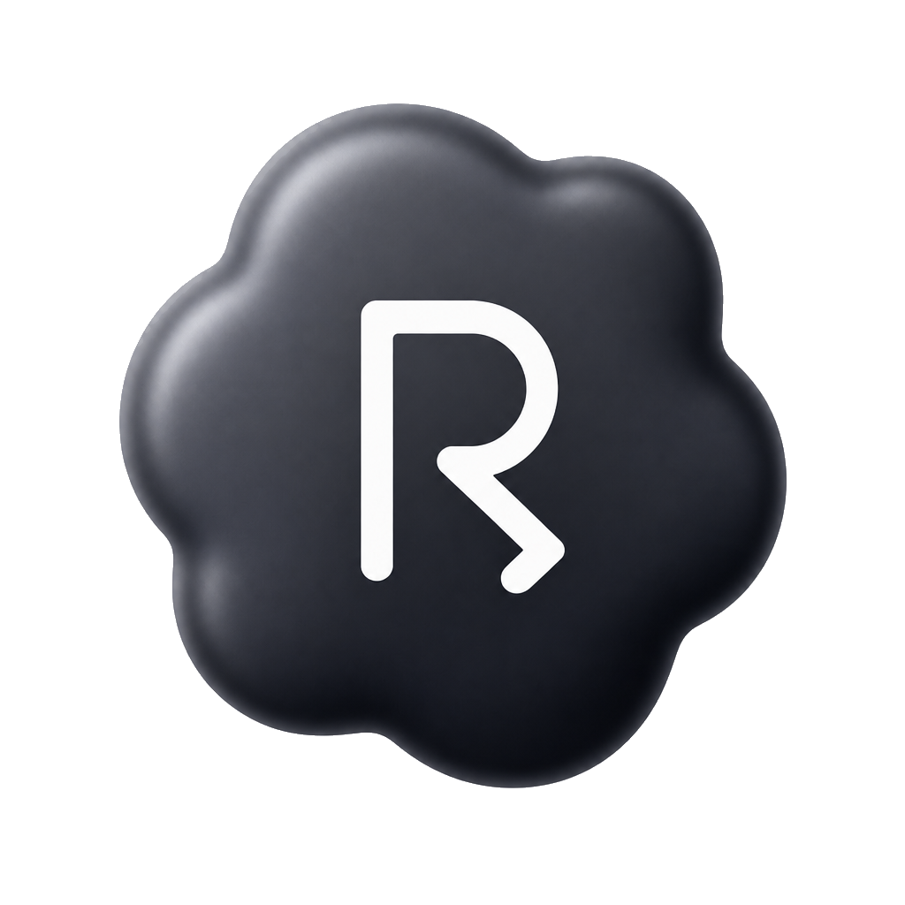

# Riot

<p align="center">
  
</p>

<p align="center">
  <strong>集 Codex、Claude Code、Cursor 三家之长的本地 AI agent</strong><br />
  模型走你自己的 API，工具在本机执行，写文件和跑命令默认先问再做。
</p>

Riot 把三家各自做对的部分收进同一个桌面产品：**Codex** 的独立内核与文档产物、**Claude Code** 的权限与扩展体系、**Cursor** 的工作台——对话、终端、浏览器、改动审阅在同一扇窗口里。Agent 读仓库、改代码、写文档、跑命令，全部发生在你的机器上，不把项目交到别人的云端执行环境。

内核是独立的 Rust 进程，界面是 Tauri + React。桌面端以 **macOS** 为首发平台，**Windows** 同步支持。

## 三家之长

| 取自 | Riot 里对应的部分 |
| --- | --- |
| **Codex** | 宿主与内核分进程，崩溃不拖垮窗口；Word / Excel / PPT / PDF 按需装运行时，渲成页面后再交付 |
| **Claude Code** | Skills、斜杠命令、Hooks、MCP、项目记忆；权限默认询问，规划模式先写计划再动手 |
| **Cursor** | 侧栏会话、流式对话、内嵌终端、内置浏览器、Git 改动面板；`@` 引用、拖放与粘贴附件 |

## 它做什么

打开一个项目，用自然语言交代任务。Riot 会搜索、阅读、编辑、执行，并在需要你拍板时停下来。

- **读写与执行**：读文件、精确替换、整文件写入、跑 shell、按 glob / 正则搜索仓库。
- **文档**：创建和编辑 Word（`.docx`）、Excel（`.xlsx` / `.xls` / `.csv`）、PPT（`.pptx`）和 PDF。表格走真实公式求值；Word / PPT / PDF 会渲成页面图，模型逐页看过再交付。机器上不必预装 Python、Node 或 LibreOffice——设置 → 能力包装上文档运行时即可，相关技能和工具自动注册。
- **权限与沙箱**：写文件、跑命令默认询问。会话可在「每次询问 / 自动接受编辑 / 规划 / 自动判危 / 全部放行 / 无人值守」之间切换；命令可限制在工作区里改文件，也可再掐掉联网。
- **规划后再动手**：规划模式只读侦察并写出计划，你批准后才改代码。
- **看见同一份环境**：内嵌终端可共享给 agent；内置浏览器与对话共用同一页，模型点、输、截图时你也能看见；右侧可切换到 Git 改动。
- **自带模型**：OpenAI 兼容或 Anthropic Messages。DeepSeek、Kimi、Qwen、OpenRouter、vLLM、Ollama 都走前者。API key 单独存在 `auth.json`（权限 0600），不进普通配置。
- **可扩展**：Skills、斜杠命令、Hooks、MCP。改完下一轮对话生效，不用重启。

## 开始使用

需要 Rust 1.88+、Node 22、pnpm 10，以及一个能用的模型 API key。

```bash
pnpm install
pnpm tauri dev
```

第一次启动会选择项目目录。在设置里添加服务方、粘贴 API key、选中模型即可对话。

从 Dock 或访达启动的应用继承不到 shell 环境变量，这是 macOS 的行为。日常开发用 `pnpm tauri dev`；key 已经在设置里存过，不必再 `export`。环境变量与存档同名时优先于存档，用来临时覆盖。

只看前端布局（宿主 bridge 不可用）：

```bash
pnpm dev
```

想先在终端确认模型链路（GUI 会把 key 没读到、base URL 写错、模型名不存在都表现成「没反应」）：

```bash
export DEEPSEEK_API_KEY=sk-...
cargo run -p riot-providers --example smoke

MODEL=deepseek-reasoner cargo run -p riot-providers --example smoke

BASE_URL=https://api.moonshot.cn MODEL=kimi-k2-turbo-preview \
  KEY_ENV=MOONSHOT_API_KEY cargo run -p riot-providers --example smoke
```

打包桌面端（`.app` / `.dmg` / NSIS）：

```bash
./scripts/build-browser.sh    # 内置浏览器；没有它时聊天仍可用
pnpm tauri build
```

产物在 `src-tauri/target/release/bundle/`。浏览器是可选能力：没打过包也能起主应用，只是 Browser 工具和面板不可用。

## 日常用法

配置目录在设置 → 关于里可以看到。macOS 默认是 `~/Library/Application Support/riot`，Windows 是 `%APPDATA%\riot`。

| 能力 | 全局 | 项目级 |
| --- | --- | --- |
| 记忆 | `<配置目录>/AGENTS.md` | `<项目>/AGENTS.md`（没有则读 `CLAUDE.md`） |
| Skills | `<配置目录>/skills/<名>/SKILL.md` | `<项目>/.riot/skills/` |
| 斜杠命令 | `<配置目录>/commands/*.md` | `<项目>/.riot/commands/` |
| Hooks | `<配置目录>/hooks.json` | `<项目>/.riot/hooks.json`（两层都跑） |
| MCP | 设置 → MCP | — |
| 能力包 | 设置 → 能力包（文档运行时等） | — |

- 记忆注入首条消息，支持 `@路径` 引用。
- Skills 渐进披露：清单进上下文，正文用到才读。
- 输入框敲 `/` 调斜杠命令。`$ARGUMENTS` 是整段参数，`$1`–`$9` 是第 N 个（引号内算一个）。子目录是命名空间：`commands/git/pr.md` → `/git:pr`。内置 `/compact` 可手动压缩历史。
- 输入框敲 `@` 引用文件。单个文件 24 KB、一条消息合计 64 KB，超出截断并提示模型自己去读。
- 也可以把文件拖到窗口任意位置，或从访达 / 资源管理器复制后粘贴。图片进附件条，其它文件收成 `@` 引用。网页里直接拖出的图在磁盘上没有文件，改用复制粘贴。
- MCP 走 stdio，工具和内置工具同一套权限管线。

Hooks 对齐四个检查点：`PreToolUse`、`PostToolUse`、`Stop`、`UserPromptSubmit`。脚本从 stdin 收一行事件 JSON。**exit 2 = 拦下**，stderr 是给模型的理由；exit 0 的 stdout 可作为补充上下文。hook 的 `allow` 压不过安全检查和你自己写的 ask 规则。

## 设计原则

Riot 默认不信任工具，也不把执行权交给远端。

- **本地执行**：读仓库、改文件、跑命令都在本机。云端只发生在你配置的模型 API。
- **Fail-closed**：工具默认会写、默认需要权限；shell 解析不了就问人。
- **崩溃隔离**：内核是独立进程。Agent 卡住或崩溃时，窗口还能提示重启，不会整窗一起掉。
- **错误回到对话**：工具失败会作为结果喂回模型，让它自己纠正，而不是把主循环打断。

内核实现、权限决策和验证分层见 [docs/ARCHITECTURE.md](docs/ARCHITECTURE.md) 与 [docs/VERIFICATION.md](docs/VERIFICATION.md)。标了 `[约束]` 的段落是硬性要求。

## 开发

```bash
cargo check --workspace
cargo test --workspace          # 不变量断言只在 debug 下 panic，不要只跑 release
cargo clippy --workspace --all-targets -- -D warnings
cargo fmt
pnpm typecheck

# 改了 riot-protocol 里的类型之后必须重新生成，CI 会检查是否同步
pnpm gen
```

`--workspace` 不包含 `riot-browser`（独立 Cargo workspace，避免把 CEF 编进日常构建）。首次使用内置浏览器：

```bash
# 将 CEF 拉到 $HOME/.local/share/cef（或设置 CEF_PATH）
# 二进制来自 https://github.com/tauri-apps/cef-rs 的 export-cef-dir
./scripts/build-browser.sh
```

macOS 上浏览器必须从 `.app` bundle 启动。`pnpm tauri dev` 已经在跑的话，打完包要重启一次，宿主只在启动时定位浏览器。Windows 用 `scripts/build-browser.ps1`，需要 VS 的「使用 C++ 的桌面开发」工作负载。

仓库分层：

```
crates/          内核、工具、权限、模型适配、协议
src-tauri/       宿主：窗口、会话、终端、浏览器、权限弹窗
src/             React 界面；只有 src/bridge/ 可以调用 Tauri
schemas/         从 Rust 类型生成，勿手改
docs/            架构与验证
```

依赖方向是 `protocol ← core ← kernel`。`core` 不得依赖 UI。前端不得在 `bridge/` 以外 `import @tauri-apps/api`。

## 许可

MIT。
